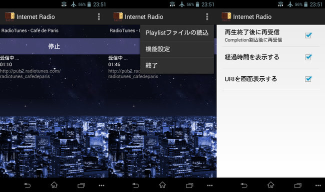

## Android ネットラジオ受信プログラム<br/>Internet Streaming Receiver<!-- omit in toc -->

[Home](https://oasis3855.github.io/webpage/) > [Software](https://oasis3855.github.io/webpage/software/index.html) > [Software Download](https://oasis3855.github.io/webpage/software/software-download.html) > [android-mediatools](../) > ***net-radio*** (this page)

<br />
<br />

Last Updated : Oct. 2015

- [ソフトウエアのダウンロード](#ソフトウエアのダウンロード)
- [概要](#概要)
- [読み込み可能なPlayList（.PLS）ファイル例](#読み込み可能なplaylistplsファイル例)
- [制限事項](#制限事項)
- [動作確認済み](#動作確認済み)
- [バージョンアップ情報](#バージョンアップ情報)
- [ライセンス](#ライセンス)

<br />
<br />

## ソフトウエアのダウンロード

- [このGitHubリポジトリを参照する（ソースコード）](./source_code/)
- [このGitHubリポジトリを参照する（apkファイル）](./apk/)
- [Googleドライブからapkファイルやソースコードの圧縮パッケージをダウンロードする](https://drive.google.com/drive/folders/0B7BSijZJ2TAHcmZqQVFEVVJCYjQ?usp=sharing)

## 概要

Androidの標準クラスandroid.media.MediaPlayerを使った、インターネット・ラジオ（ストリーミング）を受信するアプリケーションのサンプルコード。

Google Playで入手できる無料のメディアプレーヤーは、ストリーミング受信に必要無い権限を要求し、個人情報を流出させているのではという懸念から、単純機能のみのアプリケーションを作成してみた。 



実行画面例 （左：受信状態、中央：メニュー表示、右：設定画面） 

## 読み込み可能なPlayList（.PLS）ファイル例

```
[playlist]
 
Title3=181.FM - Power 181
File3=http://relay.181.fm:8128/
Length3=-1
 
Title5=181.FM - UK Top 40
File5=http://uplink.duplexfx.com:8070
Length5=-1
 
Title36=Radio Suisse Classique
File36=http://stream.srg-ssr.ch/m/rsc_fr/mp3_128
Length36=-1
 
Title37=Radio Swiss Pop
File37=http://stream.srg-ssr.ch/m/rsp/mp3_128
Length37=-1
 
Title40=RadioTunes - Café de Paris
File40=http://pub2.radiotunes.com/radiotunes_cafedeparis
Length40=-1
 
Title48=RadioTunes - Solo Piano
File48=http://pub3.radiotunes.com/radiotunes_solopiano
Length48=-1
```

## 制限事項

戻るボタンのタップや、画面回転はActivityが破棄されるため、Destroy関数で受信を強制中止している。バッググラウンドで稼働させるためにはホーム・ボタンをタップする。

PLSファイルに悪意のある文字列を記述されることは想定していない。（チエックしていない）

MeidiaPlayerクラス関数で処理中は画面が固まるのは、スレッドに分離していないから。（このアプリケーションは、単なるサンプルコードのため）

PLSファイルの選択には、別途ファイルエクスプローラなどがインストールされている必要がる。 

## 動作確認済み

- Android 4.3
- Android 2.3.3 

## バージョンアップ情報

- Version 1.0 (2015/02/03)

  - 当初 

- Version 1.2 (2015/10/25)

  - タイマー追加、画面回転でリセット防止 

## ライセンス

このスクリプトは [GNU General Public License v3ライセンスで公開する](https://gpl.mhatta.org/gpl.ja.html) フリーソフトウエア


